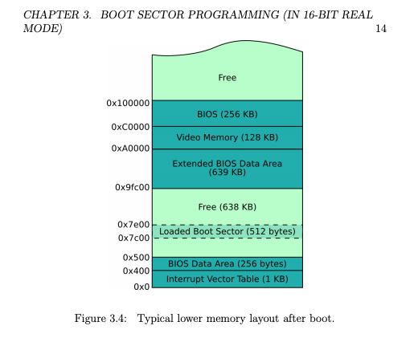

# AssemblyPlayStation
This is a repo for our assembly project which is a bootable os with multiple games.

## Project Target
我们的选题为操作系统，这是一个非常有挑战性的任务，因为我们常见的操作系统中只有极少量的代码为汇编，大部分的逻辑实现是通过C语言，因此从时间与精力的角度考虑，纯粹使用汇编语言写一个功能完整的操作系统是不现实的；经过我组成员的讨论，我们该大作业的目标如下：

1. Boot部分需要完整实现，该部分包括但不限于从16-bits模式跳转为32-bits模式，加载全局描述符表，将操作系统内核代码从硬盘载入到内存中，跳转到系统初始化代码
2. 系统初始化部分，仅实现部分必要功能，包括但不限于初始化中断向量表，初始化时钟中断与键盘中断
3. 提供必要的系统API，包括但不限于从缓冲区读入键盘输入`getchar`，在VGA文字模式下输出字符，通过`cmos`芯片获取时间，生成伪随机数，字符串与数字的相互转化
4. 在上述工作的基础上提供几个小程序，包括查看时间的程序，一个简易的跑酷游戏，秒表程序

## Usage
- 如果使用我们提供的预编译的可执行文件，请执行如下命令来运行我们的操作系统`qemu-system-i386 -fda os-image-debug.bin`
- 如果希望自行编译，首先请修改`Makefile`中`LD`与`NASM`为自己系统中的路径，接着执行`make run-debug`命令
- 如果希望调试我们的代码，请修改`Makefile`中的`GDB`为自己系统中`gdb`所在路径，接着执行`make debug`
- 进入系统后，首先看到的是菜单栏，按`W`与`S`键来选择所需运行程序，按`J`键进入所需程序，在每个程序的上方都会有该程序的使用说明，请按照说明来使用我们的系统

## Development Environment
- 系统：Ubuntu16.04
- 链接器版本：GNU ld (GNU Binutils) 2.30
- 汇编器版本：NASM version 2.13.03

## Implementation
### Boot Section
* Boot部分代码存放在`bootsect.asm`
* 当系统启动时是处于16-bits模式下的，在该模式下的内存分布情况如图所示

* 16位模式下的代码存放在`0x7c00`处，我们需要通过BIOS提供的中断将系统内核代码从启动盘中读取出来放到内存中；相关代码存放在`utils/boot_sect_disk.asm`中；
* 接着需要跳转到32位模式下，为了跳转我们需要完成如下几个步骤
	* 关闭中断
	* 加载全局描述符表
	* 设置`cr0`寄存器以转变为32位模式
	* 跳转到32位模式下的第一个函数
* 进入32位模式后首先需要将几个段寄存器设置好
* 最后设置好栈，将栈指针指向内存的最高位置
* Boot部分完成，进入系统初始化阶段

### System Initialization
* 系统初始化相关的代码存放在`main.asm`
* 我们使用`lidt`指令载入中断向量表
* 键盘和时钟信号是通过PIC传递给CPU的，我们通过端口读写把`IRQ`0-15信号映射为`ISR`32-47
* 在键盘中断的处理程序中。首先检测键盘扫描码，把有效的按下键盘事件提取出来，把按下键的`ASCII`码放到一个环形缓冲区中，以便`getchar`这一API使用；然后调用一个回调函数，并把扫描码传递给这个函数。通常情况下，这个回调函数不做任何事情，系统上应用程序的开发者可以调用`register`函数把自己定义的回调函数绑定到这里，监听键盘按下事件。
* 时钟中断的处理函数没有需要特别处理的内容，系统也提供了一个接口供用户绑定自己的时钟回调函数。

### Necessary API
* `getchar`: 由于键盘中断处理函数会自动把输入放入缓冲区，于是这个函数只需要判断缓冲区状态并从缓冲区读出一个字符即可。
* `itoa`: 为了打印数字方便，实现了一个简易的`int_to_ascii`函数，可以将一个整数转化为十进制表示的字符串，也可以通过`int_to_hex_ascii`转化为十六进制表示的字符串。
* `random`: 可以采用当前时间做种子，也可以由用户自行指定，采用简单的线性同余算法生成伪随机数。
* `VGA Driver`: 我们采用了VGA的文字模式，提供了一套较为完整的绘图API，包括`clear_screen`/`kprint_at`/`kprint`，依次可以清屏、在指定位置输出字符串、在cursor当前位置输出字符串。VGA文字模式的原理如下：VGA的显存在内存中的映射地址为`0xb800`，VGA文字模式下一共25行80列，每一个字符区存两个字节，高字节用于存放前景色与背景色信息，低字节用于存放ascii码表示的字符。通过`0x3d4`（控制端口）和`0x3d5`（数据端口）获取或设置cursor位置。

### Three simple program
#### Clock
代码存放在`clock.asm`。直接从`cmos`芯片中获取时间，根据相关文档，使用该芯片数据的端口为：`0x70`提供指令端口，`0x71`接受数据；指令如下所示；
```
Register  Contents
 0x00      Seconds
 0x02      Minutes
 0x04      Hours
 0x06      Weekday
 0x07      Day of Month
 0x08      Month
 0x09      Year
 0x32      Century (maybe)
 0x0A      Status Register A
 0x0B      Status Register B
```

#### Stopwatch
代码存放在`stopwatch.asm`。计时器使用了时钟中断，根据初始化的时候设定的时钟中断频率（50Hz），提供了一个简单的秒数计时器。

#### Dinasour
该游戏模仿了Chrome的内嵌恐龙跑酷小游戏。实现代码在`dinasour.asm`中。

**游戏规则**：进入游戏后，按`J`跳跃躲避障碍，如果躲避障碍失败则游戏结束，此时按`R`重新开始游戏。游戏中按`P`可以暂停或继续游戏。按`Q`可以退出游戏返回主菜单。

**游戏实现**：由于之前已经实现好了键盘中断和时钟中断，所以键盘操作函数（处理玩家输入事件）注册到键盘中断回调函数中，将游戏画面绘制和状态更新函数注册到时钟中断回调函数中，这样游戏就有了逻辑框架：在键盘回调函数中处理“跳跃”、“暂停”等时间，在时钟回调函数中处理更新“恐龙”，“障碍”等元素的位置，并检测碰撞，在显示器上绘制出最新的游戏画面。此外，调用之前实现好了的随机数生成函数，可以实现随机间隔地生成障碍，增加了游戏的趣味性。

## Innovation
* 提供了一个简易的管理用户程序的方法(调用用户程序，用户程序返回后取得控制权)，可以在这个系统上进行应用程序的开发。
* 应用程序可以自行编写中断的回调函数，将特定函数注册为时钟中断或者键盘中断的回调函数，方便开发。
* 提供了一套必要的的系统API，为后续的开发提供便利。

## 组内分工
- 洪方舟（2016013259）：Boot部分、系统API
- 李仁杰（2016013271）：系统初始化，菜单界面，`getchar`接口
- 王泽宇（2016013258）：三个应用程序

## Reference
- [OS Tutorial](https://github.com/cfenollosa/os-tutorial)
- [os-dev.pdf](http://www.cs.bham.ac.uk/~exr/lectures/opsys/10_11/lectures/os-dev.pdf)
- [OSDev Wiki](https://wiki.osdev.org/Main_Page)
- [Linear congruential generator](https://en.wikipedia.org/wiki/Linear_congruential_generator)
